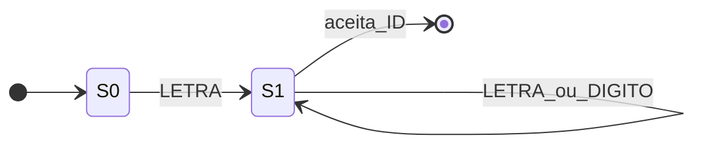
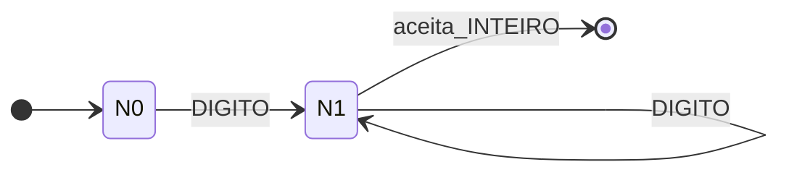
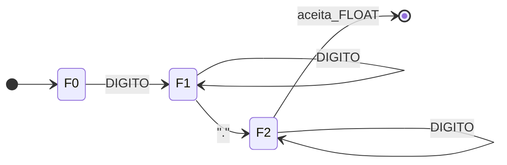
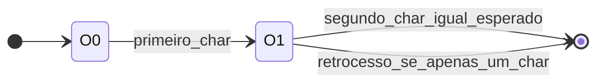
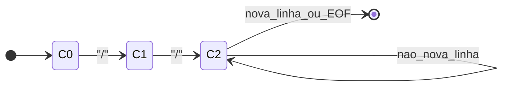
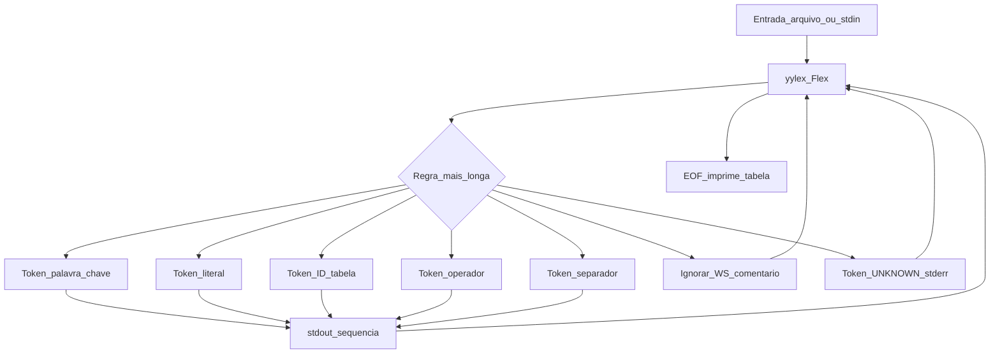

# Linguagem temática de gastronomia

Este documento especifica a **linguagem fonte** (vocabulário e estruturas pretendidas) e o **léxico reconhecido** pelo analisador implementado em Flex/C ([`scanner_c.l`](scanner_c.l)). O objetivo é permitir análise do código Flex sem ambiguidade: padrões, tokens emitidos, saída e política da tabela de símbolos.

---

## 1. Visão geral

| Aspecto | Descrição |
|--------|-------------|
| Codificação | ASCII |
| Paradigma | Imperativo, tipagem estática (conceito da linguagem; verificação semântica não é escopo do T1) |
| Analisador | Léxico apenas: sequência de tokens + tabela de símbolos para identificadores |


**Palavras-chave léxicas** 

| Lexema na fonte | Papel na linguagem | Token interno (enum) | Rótulo na saída do `main` |
|-----------------|-------------------|------------------------|----------------------------|
| `prove` | Condicional (equivalente a *if*) | `T_IF` | `<if>` |
| `se_ruim` | Ramo alternativo (equivalente a *else*) | `T_ELSE` | `<else>` |
| `cozinhando` | Repetição condicionada (equivalente a *while*) | `T_WHILE` | `<while>` |
| `medida` | Tipo inteiro | `T_INT_KEYWORD` | `<int>` |
| `liquido` | Tipo ponto flutuante | `T_FLOAT_KEYWORD` | `<float>` |
| `tempero` | Tipo caractere | `T_CHAR_KEYWORD` | `<char>` |
| `sirva` | Retorno de função | `T_RETURN` | `<return>` |


---

## 2. Especificação léxica

Definições de apelidos em Flex (equivalente a regex):

| Nome (Flex) | Padrão | Descrição |
|---------------|--------|-----------|
| `DIGITO` | `[0-9]` | Dígito decimal |
| `LETRA` | `[a-zA-Z_]` | Letra ou sublinhado (início de identificador) |
| `ID` | `{LETRA}({LETRA}\|{DIGITO})*` | Identificador |
| `INTEIRO` | `{DIGITO}+` | Literal inteiro |
| `FLOAT` | `{DIGITO}+\.{DIGITO}*` | Literal flutuante (obrigatório o ponto; parte fracionária pode ser vazia, ex.: `3.`) |
| `COMENTARIO_LINHA` | `\/\/[^\n]*` | Comentário até fim de linha |
| `COMENTARIO_BLOCO` | `\/\*([^*]\|\*+[^*/])*\*+\/` | Comentário de bloco estilo C |
| `STRING_LITERAL` | `\"[^"]*\"` | Cadeia entre aspas duplas (não permite quebra de linha nem `\"` escapado) |
| `CHAR_LITERAL` | `'[^']'` | Um caractere entre aspas simples |

### 2.1. Tabela de tokens (padrão → token → saída)

Tokens emitidos pelo `yylex()` e impressos no `switch` do `main`.

| Classe | Padrão / lexema | `return` / tipo | Saída textual (`printf`) |
|--------|-----------------|-----------------|---------------------------|
| Ignorado | espaços, tab, `\n` | (nenhum) | — |
| Ignorado | comentário linha/bloco | (nenhum) | — |
| Palavra-chave | ver tabela acima | `T_IF` … `T_RETURN` | `<if>` … `<return>` |
| Literal | `INTEIRO` | `T_INTEGER` (`yylval` = valor `atoi`) | `<num, n>` |
| Literal | `FLOAT` | `T_FLOAT` | `<float_val, texto>` |
| Literal | `STRING_LITERAL` | `T_STRING` | `<str, "…">` |
| Literal | `CHAR_LITERAL` | `T_LITERAL_CHAR` | `<char_val, 'x'>` |
| Identificador | `ID` | `T_ID` (`yylval` = índice na tabela) | `<id, índice>` |
| Operador | `==` | `T_OP_IGUALDADE` | `<==>` |
| Operador | `!=` | `T_OP_DIFERENTE` | `<!=>` |
| Operador | `<=` | `T_OP_MENOR_IGUAL` | `<<=>` |
| Operador | `>=` | `T_OP_MAIOR_IGUAL` | `<>=>` |
| Operador | `<` | `T_OP_MENOR` | `<<>` |
| Operador | `>` | `T_OP_MAIOR` | `<>>` |
| Operador | `+` | `T_OP_SOMA` | `<+>` |
| Operador | `-` | `T_OP_SUB` | `<->` |
| Operador | `*` | `T_OP_MULT` | `<*>` |
| Operador | `/` | `T_OP_DIV` | `</>` |
| Operador | `=` | `T_OP_ATRIBUICAO` | `<=>` |
| Separador | `;` | `T_PONTO_VIRGULA` | `<;>` |
| Separador | `,` | `T_VIRGULA` | `<,>` |
| Separador | `(` `)` `{` `}` `[` `]` | respectivos `T_*` | `<(>` … `<]>` |
| Erro | qualquer outro byte | `T_UNKNOWN` | mensagem em `stderr`; sem token na sequência “bonita” |

---

## 3. Estruturas da linguagem (sintaxe conceitual — EBNF)

O trabalho exige uma linguagem imperativa com variáveis numéricas (inteiro/flutuante), vetores numéricos, expressões, condicionais, laço, funções com tipos explícitos. Abaixo uma **gramática de referência** alinhada ao vocabulário gastronômico e aos tokens do scanner (não substitui um parser; serve de contrato para o grupo).

```ebnf
programa        ::= { decl_ou_item } ;
decl_ou_item    ::= decl_var ";"
                  | decl_fun
                  | comando ;

decl_var        ::= tipo IDENT [ "[" expr_inteira "]" ] ;
tipo            ::= "medida" | "liquido" | "tempero" ;
expr_inteira    ::= INTEIRO ;   (* literal positivo na declaração de tamanho *)

comando         ::= atrib ";"
                  | chamada ";"
                  | "prove" "(" expr ")" bloco [ "se_ruim" bloco ]
                  | "cozinhando" "(" expr ")" bloco
                  | "sirva" [ expr ] ";"
                  | bloco ;

atrib           ::= IDENT "=" expr
                  | IDENT "[" expr "]" "=" expr ;

chamada         ::= IDENT "(" [ lista_expr ] ")" ;

bloco           ::= "{" { comando } "}" ;

decl_fun        ::= tipo IDENT "(" [ params ] ")" bloco ;
params          ::= param { "," param } ;
param           ::= tipo IDENT ;

expr            ::= expr_rel ;
expr_rel        ::= expr_arit [ ( "==" | "!=" | "<" | ">" | "<=" | ">=" ) expr_arit ] ;
expr_arit       ::= termo { ( "+" | "-" ) termo } ;
termo           ::= fator { ( "*" | "/" ) fator } ;
fator           ::= INTEIRO | FLOAT | CHAR_LITERAL | STRING_LITERAL
                  | IDENT [ "[" expr "]" | "(" [ lista_expr ] ")" ]
                  | "(" expr ")" ;

lista_expr      ::= expr { "," expr } ;
```

---

## 4. Tabela de símbolos e formato de saída

Implementação em [`scanner_c.l`](scanner_c.l):

- Vetor `symbol_table[MAX_SYMBOLS]` com `MAX_SYMBOLS = 100`.
- Função `get_symbol_position(const char *id)`:
  - Se o identificador já existe, retorna o **índice** existente.
  - Caso contrário, insere cópia com `strdup` e retorna o novo índice (`0..symbol_count-1`).
  - Se a tabela estiver cheia, emite erro em `stderr` e retorna `-1` (nesse caso o `yylex` não retorna `T_ID` de forma útil para o índice).

**Saída padrão:**

1. Linha inicial `Sequência de Tokens:` seguida dos tokens na ordem de leitura.
2. Identificadores como `<id, n>` onde `n` é o índice na tabela.
3. Ao final, bloco `--- Tabela de Símbolos Final ---` listando `Posição | Identificador`.

**Fim de arquivo:** `yylex()` retorna `0` (`T_EOF`) e o laço do `main` encerra.

---

## 5. Tratamento de erros léxicos

- Qualquer caractere que **não** case com nenhuma regra antes do catch-all `.` gera:
  - Mensagem em `stderr`: `Erro Léxico na linha L: Caractere inesperado 'X'`
  - Retorno `T_UNKNOWN`; no `switch` do `main`, o caso não imprime token na sequência (apenas o erro).

**Exemplos de erro:**

- Caractere Unicode ou acentuado fora do conjunto esperado pelo padrão (depende do arquivo fonte em bytes).
- Operador ou símbolo não previsto (ex.: `@`).

**Limitações do léxico atual (documentar = honestidade):**

- `STRING_LITERAL` não admite `\"` ou quebra de linha dentro da string.
- `CHAR_LITERAL` admite exatamente um caractere entre aspas; não há escape para `\'`.

---

## 6. Diagramas de transição (autômatos finitos)


### 6.1. Identificador (`ID`)



### 6.2. Literal inteiro (`INTEIRO`)



### 6.3. Literal flutuante (`FLOAT` = dígitos + '.' + dígitos opcionais)



### 6.4. Operadores de dois caracteres (`==`, `!=`, `<=`, `>=`)



### 6.5. Comentário de linha



### 6.6. Fluxo geral do analisador (visão de processo)



---

## 7. Guia de compilação e execução

Ambiente típico: **Flex** + **GCC** (MinGW/MSYS2/WSL no Windows).

```bash
# Gerar lex.yy.c a partir da especificação Flex
flex -o lex.yy.c scanner_c.l

# Compilar o scanner com a biblioteca do Flex (-lfl no Linux; no MinGW muitas vezes não é necessário)
gcc -o lexer lex.yy.c

# Executar sobre um arquivo fonte da linguagem
./lexer teste.lang
```

A saída esperada começa com `Sequência de Tokens:` e termina com a tabela de símbolos. Compare com o exemplo em [`teste.lang`](teste.lang).

---

## 8. Exemplo completo 

Arquivo [`teste.lang`](teste.lang) ilustra declarações, atribuições, vetor, condicional com `se_ruim`, laço `cozinhando` e `sirva`.

---

## 9. Referências de arquivos

| Arquivo | Papel |
|---------|--------|
| [`scanner_c.l`](scanner_c.l) | Especificação Flex, enum de tokens, tabela de símbolos, `main` |
| [`teste.lang`](teste.lang) | Exemplo de programa fonte |
| [`Trabalho1_Requisitos.md`](Trabalho1_Requisitos.md) | Enunciado e critérios de avaliação |
